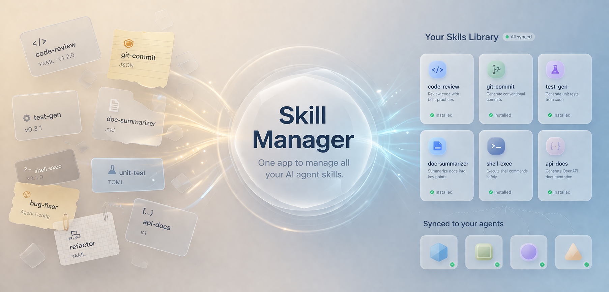
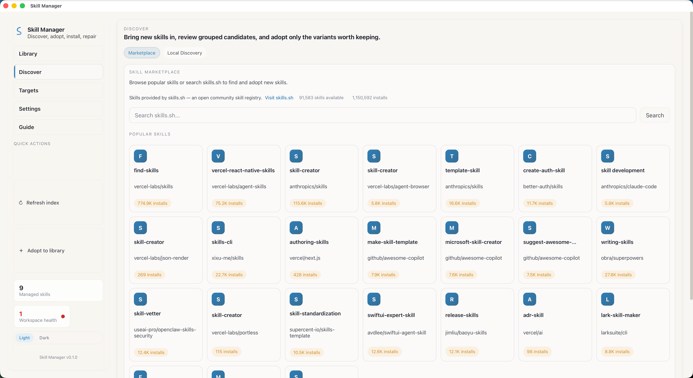

<div align="center">



# ⚡ Skill Manager

### 一个应用，管理所有 AI 智能体技能。

发现、安装、同步技能到 **Codex · Claude Code · Agent** — 一个漂亮的桌面应用搞定一切。

<br/>

[![Release][release-shield]][release-link]
[![License][license-shield]][license-link]
[![Stars][stars-shield]][stars-link]
[![Issues][issues-shield]][issues-link]

<a href="./README_zh.md"></a>
<a href="./README.md"></a>

<br/>

[🌐 skills.sh](https://skills.sh) · [📖 使用指南](#-内置指南) · [🚀 快速开始](#-快速开始) · [📦 下载安装](https://github.com/ZhangYiqun018/skill-manager-client/releases)

<br/>



</div>

<br/>

## 🤔 为什么需要 Skill Manager？

AI 智能体很强大 — 但管理它们的技能是一团糟。

技能散落在全局配置、项目目录和不同的智能体格式中。把一个技能安装到三个智能体意味着编辑三个配置文件。更新？再来一遍。**一定有更好的方法。**

```
                ┌─────────────┐
                │  skills.sh  │  ← 远程技能市场
                │  注册中心    │
                └──────┬──────┘
                       │  搜索 / 采纳
                       ▼
              ┌─────────────────┐
              │  Skill Manager  │  ← 本应用
              │   ┌───────────┐ │
              │   │  技能库    │ │  管理、版本、差异对比
              │   │  发现      │ │  扫描、导入、冲突解决
              │   │  安装目标  │ │  安装、修复、同步
              │   └───────────┘ │
              └────────┬────────┘
                       │  符号链接 / 复制
          ┌────────────┼────────────┐
          ▼            ▼            ▼
    ┌──────────┐ ┌──────────┐ ┌──────────┐
    │  Codex   │ │  Claude  │ │  Agent   │
    │  CLI     │ │  Code    │ │  (通用)   │
    └──────────┘ └──────────┘ └──────────┘
```

**Skill Manager 给你一个统一的管理界面**，发现、安装、更新和修复你使用的每个智能体的技能。

<br/>

## ✨ 功能特性

<table>
<tr>
<td width="50%">

### 🏪 技能市场

从 **[skills.sh](https://skills.sh)** 注册中心搜索和采纳技能。一键添加到技能库，选择智能体和作用域。

</td>
<td width="50%">

### 📚 技能库

在画廊视图中浏览所有托管技能。一眼看到健康状态、变体、安装历史和文件差异。

</td>
</tr>
<tr>
<td>

### 🔍 技能发现

扫描整个磁盘中已有的技能。导入本地文件夹。用可视化差异工具解决重复和变体冲突。

</td>
<td>

### 🎯 多智能体安装

一键将技能安装到 **Codex + Claude Code + Agent**。选择符号链接（省空间）或复制（便携）。

</td>
</tr>
<tr>
<td>

### 🎨 玻璃拟态 UI

莫兰迪色系配合玻璃拟态表面。暖纸色浅色主题 ☀️ 和墨蓝色深色主题 🌙，一键切换。

</td>
<td>

### ⌨️ 键盘优先

`Cmd/Ctrl+1~5` 切换页面 · `Cmd/Ctrl+K` 聚焦搜索 · `Cmd/Ctrl+R` 刷新索引。全键盘操作，无需鼠标。

</td>
</tr>
<tr>
<td>

### 🌍 双语界面

完整的 English 和中文界面。运行时切换，无需重启。

</td>
<td>

### 📡 离线可用

磁盘扫描和本地导入无需联网。只在浏览市场时才需要网络。

</td>
</tr>
</table>

<br/>

## 🏗️ 架构

```
┌──────────────────────────────────────────────────┐
│                    桌面应用                        │
│  ┌─────────────────────────────────────────────┐ │
│  │           React 19 + TypeScript              │ │
│  │  ┌──────────┬──────────┬──────────┬───────┐ │ │
│  │  │  技能库  │   发现   │ 安装目标 │  ...  │ │ │
│  │  └──────────┴──────────┴──────────┴───────┘ │ │
│  │       CSS Modules · 莫兰迪设计令牌           │ │
│  └──────────────────┬──────────────────────────┘ │
│                     │ Tauri IPC                    │
│  ┌──────────────────┴──────────────────────────┐ │
│  │            Rust 后端 (Tauri v2)               │ │
│  │  ┌────────────────────────────────────────┐ │ │
│  │  │         skill-manager-core             │ │ │
│  │  │   扫描 · 索引 · 安装 · SQLite          │ │ │
│  │  └────────────────────────────────────────┘ │ │
│  └─────────────────────────────────────────────┘ │
└──────────────────────────────────────────────────┘
```

| 层级       | 技术                                            |
| :--------- | :---------------------------------------------- |
| **前端**   | React 19、TypeScript、Vite 7                    |
| **后端**   | Tauri v2、Rust 2024 Edition                     |
| **核心**   | `skill-manager-core` — 扫描、索引、安装、SQLite |
| **命令行** | `skill-manager-cli` — 无头操作                  |
| **样式**   | CSS Modules + 莫兰迪设计令牌 + 玻璃拟态         |

<br/>

## 🚀 快速开始

### 前置条件

- [Rust](https://rustup.rs/) 1.80+
- [Node.js](https://nodejs.org/) 20+ & [pnpm](https://pnpm.io/) 9+

### 开发模式

```bash
# 1. 克隆
git clone https://github.com/ZhangYiqun018/skill-manager-client.git
cd skill-manager-client

# 2. 安装依赖
pnpm install

# 3. 运行
pnpm desktop:dev
```

### 生产构建

```bash
pnpm desktop:build
```

### 命令行工具

```bash
cargo run -p skill-manager-cli -- scan --json
```

<br/>

## 📁 项目结构

```
skill-manager-client/
├── apps/desktop/              # 🖥️  Tauri 桌面应用
│   ├── src/                   #     React 前端
│   │   ├── features/          #     技能库、发现、目标、设置、指南
│   │   ├── components/        #     共享 UI 组件
│   │   ├── hooks/             #     自定义 React Hooks
│   │   ├── styles/            #     CSS Modules（莫兰迪令牌）
│   │   └── locales/           #     国际化（en、zh）
│   └── src-tauri/             #     Rust 后端
├── crates/skill-manager-core/ # ⚙️  核心逻辑（扫描、索引、SQLite）
├── crates/skill-manager-cli/  # 💻  命令行界面
└── .github/workflows/         # 🔄  CI + 发布（macOS/Win/Linux）
```

<br/>

## 📖 内置指南

Skill Manager 内置了完整的使用指南，包含可折叠的章节，涵盖每个功能 — 从快速入门到键盘快捷键再到常见问题。在应用内点击 **指南** 标签页即可访问。

<br/>

## 🤝 参与贡献

欢迎贡献！请查看 [CONTRIBUTING.md](./CONTRIBUTING.md) 了解环境搭建、代码规范和 PR 检查清单。

<br/>

## 📄 许可证

[MIT](./LICENSE) © Skill Manager Contributors

---

<div align="center">

**如果 Skill Manager 帮到了你，请考虑给个 ⭐**

[⬆ 回到顶部](#-skill-manager)

</div>

<!-- 链接引用 -->

[release-shield]: https://img.shields.io/github/v/release/ZhangYiqun018/skill-manager-client?style=flat&color=blue
[release-link]: https://github.com/ZhangYiqun018/skill-manager-client/releases
[license-shield]: https://img.shields.io/github/license/ZhangYiqun018/skill-manager-client?style=flat
[license-link]: ./LICENSE
[stars-shield]: https://img.shields.io/github/stars/ZhangYiqun018/skill-manager-client?style=flat
[stars-link]: https://github.com/ZhangYiqun018/skill-manager-client/stargazers
[issues-shield]: https://img.shields.io/github/issues/ZhangYiqun018/skill-manager-client?style=flat
[issues-link]: https://github.com/ZhangYiqun018/skill-manager-client/issues
